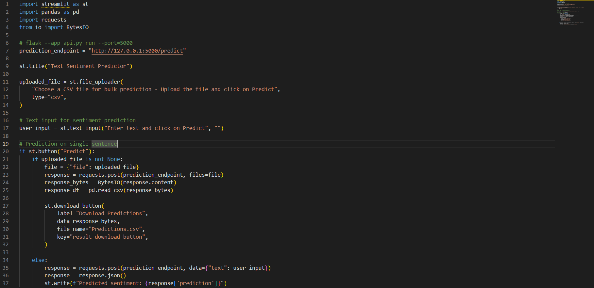

# ABOUT ME

Hi there! I am a data scientist with experience in machine learning, NLP, and predictive analytics. I have a proven track record of driving business outcomes in finance. I help businesses solve their challenges by delivering data-driven solutions that optimize decision-making and create sustainable growth. Could you contact me to scale your business and drive measurable growth?

## WHAT I HAVE DONE 

🌟 **Driving Revenue Growth**  
Reactivated over **20,000** corporate accounts through advanced churn mitigation models, resulting in a [**NGN 2.29 trillion increase**](https://africanfinancials.com/document/ng-wemaba-2024-ir-q3/) in customer deposits and driving sustainable business growth.

🌟 **Expanding Market Reach**  
Developed a segmentation model targeting female SMEs, achieving a **1,428% growth in loans** and a [**NGN 1 trillion loan growth**](https://africanfinancials.com/document/ng-wemaba-2024-ir-q3/), contributing to [**61% of total interest income**](https://nairametrics.com/2024/07/31/wema-bank-plc-reports-270-71-growth-in-q2-2024-pre-tax-profit/).

🌟 **Delivering Scalable Solutions**  
Designed and deployed the AI chatbot, reducing turnaround time for **2,000+ staff** and cutting operational expenses while improving internal efficiency and **customer satisfaction scores by 48%**.

## PROJECTS 

*A glimpse of some of the projects I've worked on.*

**Natural Language Processing End-End Project for Sentiment Analysis**

Built a sentiment analysis solution using Flask to create a web API for real-time sentiment prediction and bulk analysis through CSV file uploads. This solution provides actionable insights into customer sentiment, enabling better understanding and improvement of business strategies.
Key Tools: Python, Flask, XGBoost, SHAP, NLTK, Pandas, Matplotlib, HTML/CSS
*[Project Link](https://github.com/Premee12/NLP-sentiment-analysis-prediction.git)*

**Customer Churn Analysis Using SQL**

Utilized Advanced SQL techniques to extract insights from multi-year customer data to identify churn patterns and the factors influencing customer attrition.
Key Tools: MySQL database
*[Project Link](https://github.com/Premee12/Tel-Customer-Churn-SQL-Project.git)*

**Customer Churn Using Python**

Trained a churn model using different ML and deep learning algorithms and deployed the most efficient based on evaluation criteria. 
*[Project Link](https://github.com/Premee12/Churn_project.git)*

## SKILLS 🛠️

| Programming & Tools       | Data Platforms           | Analytics & Reporting  | Machine Learning       | Collaboration & More         |
|----------------------------|--------------------------|-------------------------|-------------------------|-------------------------------|
| Python (3 years)          | Google BigQuery         | Power BI               | Azure                  | Basic MLOps                  |
| SQL                       | Azure Synapse           | MS Excel               | LLM                    | MongoDB                      |
| Flask                     | MS SQL Server           | Tableau                | Scikit-learn           | Reporting & Documentation    |
| PyTorch                   | MySQL                   | Microsoft 365          | Keras & TensorFlow     | Postman                      |
| Git                       | PostgresSQL             | Microsoft Power Apps   | Data Wrangling         | Latex                         |

## CONTACT DETAILS

*Let’s connect and see how we can make a difference together!*
<table>
  <tbody>
    <tr>
      <td>📧</td>
      <td><a href="mailto:abayomialliayomide@gmail.com">abayomialliayomide@gmail.com</a></td>
    </tr>
    <tr>
      <td>📍</td>
      <td>France</td>
    </tr>
    <tr>
      <td>🌐</td>
      <td><a href="http://www.linkedin.com/in/ayomide-abayomi-alli/">LinkedIn</a></td>
    </tr>
    <tr>
      <td>💻</td>
      <td><a href="https://github.com/Premee12">GitHub</a></td>
    </tr>
  </tbody>
</table>
